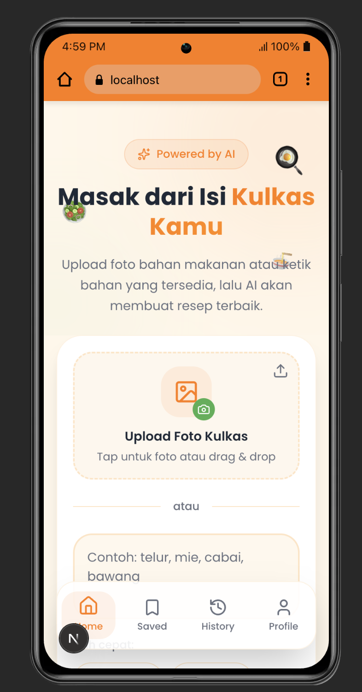

# g - AI Cooking Assistant

Aplikasi web AI untuk menghasilkan resep masakan berdasarkan bahan-bahan yang tersedia. Pengguna dapat memasukkan bahan secara teks atau mengupload foto bahan makanan.

## Tampilan Aplikasi



## Fitur Utama

- **Generate Resep dari Teks** - Masukkan bahan-bahan yang tersedia, AI akan memberikan resep lengkap
- **Generate Resep dari Gambar** - Upload foto bahan makanan, AI akan menganalisis dan memberikan resep
- **Quick Select Chips** - Pilih bahan umum dengan cepat (telur, mie, ayam, nasi, keju, cabai)
- **Simpan Resep** - Bookmark resep favorit untuk dilihat nanti
- **Riwayat** - Lihat resep yang pernah di-generate sebelumnya
- **Mobile-First Design** - Dioptimalkan untuk penggunaan di smartphone

## Tech Stack

### Frontend

- **Next.js 15** - React framework dengan App Router
- **TypeScript** - Type-safe JavaScript
- **Tailwind CSS** - Utility-first CSS framework
- **Framer Motion** - Animasi dan transisi
- **Zustand** - State management untuk menyimpan resep dan riwayat

### Backend

- **Express.js** - Node.js web framework
- **Google Generative AI (Gemini)** - AI model untuk generate resep
- **Multer** - Handling file upload

## Arsitektur Project

```
cook-chatbots-ai-app/
├── app/                    # Next.js App Router
│   ├── layout.tsx          # Root layout dengan font dan metadata
│   ├── page.tsx            # Halaman utama aplikasi
│   └── globals.css         # Design tokens dan global styles
│
├── backend/                # Express.js Backend
│   ├── server.js           # Server utama dengan endpoint API
│   ├── uploads/            # Folder temporary untuk file upload
│   └── .env                # Environment variables (GEMINI_API_KEY)
│
├── components/             # React Components
│   ├── hero-section.tsx    # Hero section dengan animasi
│   ├── image-upload.tsx    # Komponen upload gambar
│   ├── ingredient-input.tsx # Input bahan dengan chips
│   ├── generate-button.tsx # Tombol generate dengan loading state
│   ├── loading-state.tsx   # Animasi loading saat generate
│   ├── recipe-card.tsx     # Card untuk menampilkan resep
│   ├── recipe-details.tsx  # Modal detail resep lengkap
│   ├── bottom-navigation.tsx # Navigasi bawah
│   ├── saved-recipes.tsx   # View resep tersimpan
│   ├── history-view.tsx    # View riwayat resep
│   ├── profile-view.tsx    # View profil pengguna
│   ├── empty-state.tsx     # Tampilan saat data kosong
│   └── toast-notification.tsx # Notifikasi toast
│
├── lib/                    # Utilities dan Services
│   ├── api.ts              # API service untuk komunikasi dengan backend
│   ├── store.ts            # Zustand store untuk state management
│   └── utils.ts            # Utility functions
│
└── public/                 # Static assets
```

## API Endpoints

### Backend (Express.js)

| Method | Endpoint               | Deskripsi                      |
| ------ | ---------------------- | ------------------------------ |
| GET    | `/health`              | Cek status server dan model AI |
| POST   | `/generate-text`       | Generate resep dari teks bahan |
| POST   | `/generate-from-image` | Generate resep dari gambar     |

#### POST /generate-text

```json
// Request
{
  "prompt": "telur, nasi, kecap"
}

// Response
{
  "success": true,
  "data": "{ \"title\": \"Nasi Goreng\", ... }"
}
```

#### POST /generate-from-image

```
// Request (multipart/form-data)
- file: [image file]
- prompt: "Analisis gambar ini..."

// Response
{
  "success": true,
  "data": "{ \"title\": \"Resep\", ... }"
}
```

## Cara Menjalankan

### Prasyarat

- Node.js v18+
- npm atau yarn
- API Key dari Google AI Studio

### 1. Clone Repository

```bash
git clone https://github.com/username/cook-chatbots-ai-app.git
cd cook-chatbots-ai-app
```

### 2. Setup Environment Variables

Buat file `.env` di folder `backend/`:

```env
PORT=3000
GEMINI_API_KEY=your_gemini_api_key_here
```

**Cara mendapatkan API Key:**

1. Buka https://aistudio.google.com/app/apikey
2. Login dengan akun Google
3. Klik "Create API Key"
4. Copy dan paste ke file `.env`

### 3. Install Dependencies

**Frontend:**

```bash
npm install
```

**Backend:**

```bash
cd backend
npm install express cors multer dotenv @google/generative-ai
```

### 4. Jalankan Aplikasi

Buka **2 terminal** terpisah:

**Terminal 1 - Backend:**

```bash
cd backend
node server.js
```

Server berjalan di `http://localhost:3000`

**Terminal 2 - Frontend:**

```bash
npm run dev
```

Aplikasi berjalan di `http://localhost:3001`

### 5. Akses Aplikasi

Buka browser dan akses `http://localhost:3001`

## Konfigurasi Model AI

Model Gemini dapat diubah di file `backend/server.js`:

```javascript
// ============================================
// KONFIGURASI MODEL - Ganti model di sini
// ============================================
const MODEL_NAME = "gemini-2.0-flash";

// Model yang tersedia:
// - 'gemini-2.0-flash'      (cepat, hemat quota)
// - 'gemini-2.0-flash-lite' (sangat cepat, ringan)
// - 'gemini-2.5-pro'        (lebih akurat, lebih lambat)
// - 'gemini-2.5-flash'      (balance antara kecepatan dan akurasi)
```

## Environment Variables

| Variable              | Deskripsi                                    | Required |
| --------------------- | -------------------------------------------- | -------- |
| `GEMINI_API_KEY`      | API Key dari Google AI Studio                | Ya       |
| `PORT`                | Port untuk backend server (default: 3000)    | Tidak    |
| `NEXT_PUBLIC_API_URL` | URL backend (default: http://localhost:3000) | Tidak    |

## Troubleshooting

### Error: API_KEY_INVALID

- Pastikan API key valid dan belum expired
- Buat API key baru di https://aistudio.google.com/app/apikey
- Pastikan tidak ada spasi di awal/akhir key

### Error: Cannot find module

```bash
# Di root project
npm install

# Di folder backend
cd backend
npm install express cors multer dotenv @google/generative-ai
```

### Error: ECONNREFUSED

- Pastikan backend sudah berjalan di terminal terpisah
- Cek apakah port 3000 tidak digunakan aplikasi lain

### Frontend tidak konek ke backend

- Pastikan `NEXT_PUBLIC_API_URL` mengarah ke URL backend yang benar
- Cek CORS sudah diaktifkan di backend

## License

MIT License

## Author
